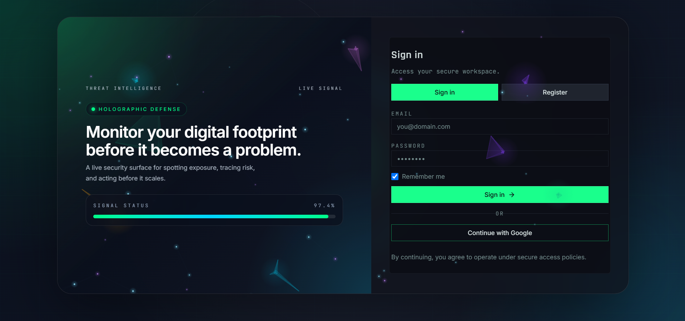
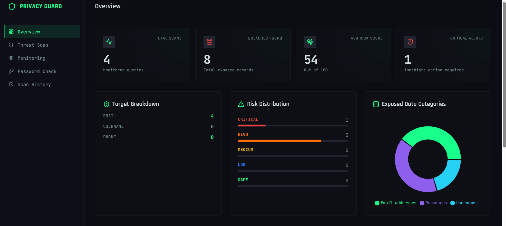
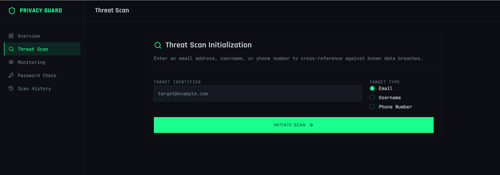
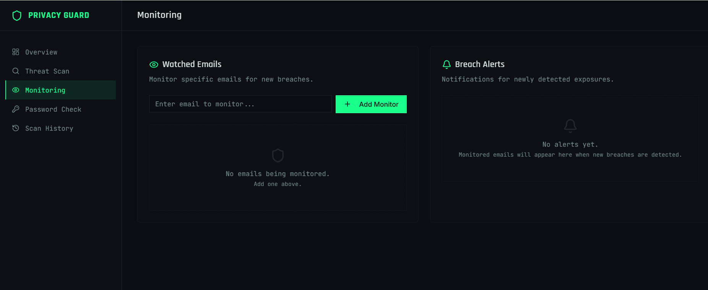
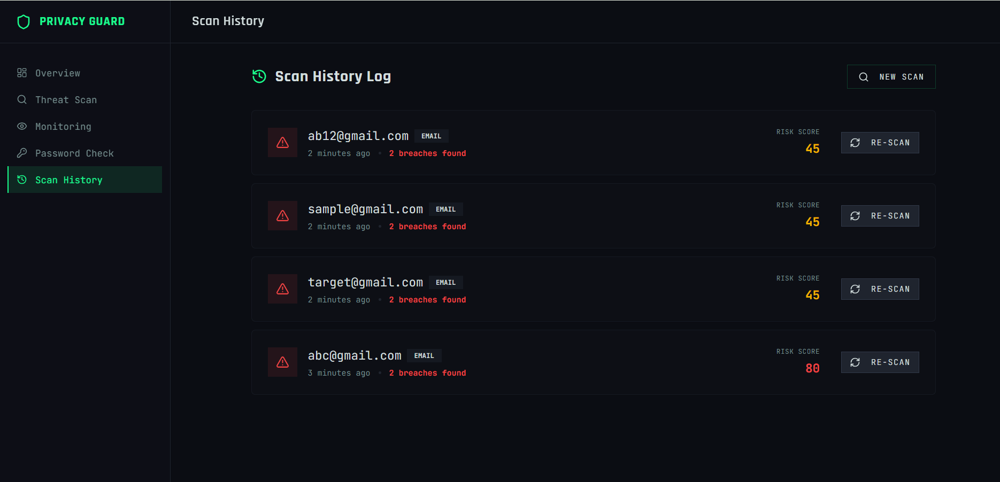
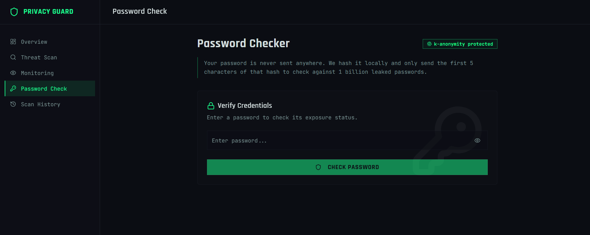
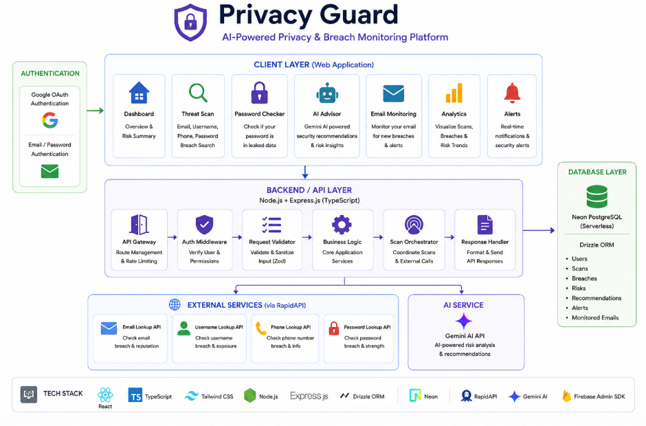

# 🛡️ Privacy Guard — AI-Powered Privacy & Breach Monitoring Platform

An intelligent cybersecurity platform that helps users detect exposed credentials, monitor privacy risks, analyze security exposure, and receive AI-powered recommendations for protecting their digital identity.

---

## 🚀 Live Demo

🌐 **Frontend:** https://privacy-guard-one.vercel.app/
 
🔗 **Backend API:** https://privacy-guard-api.onrender.com

---

## 🚀 Overview

Privacy Guard is an AI-powered cybersecurity platform designed to help users proactively monitor and secure their online presence. The platform scans emails, usernames, phone numbers, and passwords against known breach intelligence sources, generates risk scores, and provides actionable recommendations using AI.

By combining threat intelligence, external APIs, authentication services, and AI-powered analysis, Privacy Guard enables users to detect exposures before they become security incidents.

---

## 🧠 Key Features

🔍 **Threat Scanning** for emails, usernames, and phone numbers

🔐 **Password Breach Checker** with privacy-preserving verification

🤖 **AI Risk Advisor** powered by Gemini AI

📧 **Email Monitoring** and breach alerts

📊 **Interactive Security Dashboard**

🕒 **Scan History Tracking**

🚨 **Real-Time Risk Analysis**

🔑 **Google OAuth & Email Authentication**

🛡️ **Privacy Exposure Analysis**

📈 **Risk Score Generation**

---

## 📸 Screenshots

### 🔐 Authentication
<p align="center">
  
</p>

---

### 📊 Overview Dashboard
<p align="center">
  
</p>

---

### 🔍 Threat Scan
<p align="center">
  
</p>

---

### 📧 Monitoring
<p align="center">
  
</p>

---

### 🕒 Scan History
<p align="center">
  
</p>

---

### 🔐 Password Checker
<p align="center">
  
</p>

---

## 🏗️ Architecture

<p align="center">
  
</p>

---

## ⚙️ Workflow

```text
User Authentication
(Google OAuth / Email Login)
            ↓
Enter Email / Username / Phone Number
            ↓
Threat Scan Request
            ↓
Express.js Backend API
            ↓
RapidAPI Integrations
 ├── Email Lookup
 ├── Username Lookup
 ├── Phone Lookup
 └── Password Breach Check
            ↓
Gemini AI Risk Advisor
            ↓
Neon PostgreSQL Database
(Drizzle ORM)
            ↓
Risk Analysis & Monitoring
            ↓
Dashboard Insights & Alerts
```

---

## 🛠️ Tech Stack

| Category | Technologies |
|----------|-------------|
| 🎨 Frontend | React, TypeScript, Tailwind CSS |
| ⚙️ Backend | Node.js, Express.js |
| 🗄️ Database | Neon PostgreSQL |
| 🧩 ORM | Drizzle ORM |
| 🤖 AI | Gemini API |
| 🔐 Authentication | Firebase Auth, Google OAuth |
| 🌐 APIs | RapidAPI |
| ☁️ Deployment | Vercel, Render |

---

## 📂 Repository Structure

```bash
privacy-guard/
│
├── client/
│
├── server/
│   ├── src/
│   │   ├── routes/
│   │   ├── services/
│   │   ├── lib/
│   │   └── db/
│
├── images/
│
├── shared/
│
├── README.md
└── package.json
```

---

## 🚀 Run Locally

```bash
# Clone repository
git clone https://github.com/vyshnavi-0512/privacy-guard.git

# Navigate to project
cd privacy-guard

# Install dependencies
npm install

# Start development server
npm run dev
```

---

## 🔒 Core Modules

🔐 Authentication & User Management

🔍 Threat Intelligence Scanner

📧 Email Monitoring System

🛡️ Password Exposure Checker

🤖 AI Risk Advisor

📊 Analytics Dashboard

🕒 Scan History Tracking

📈 Risk Scoring Engine

---

## 📈 Metrics Tracked

📧 Monitored Emails

🔓 Breached Accounts

⚠️ Risk Scores

📊 Exposure Categories

🕒 Scan History

🚨 Critical Alerts

---

## 🛣️ Future Improvements

🔲 Real-Time Breach Notifications

🔲 Browser Extension

🔲 Dark Web Monitoring

🔲 Advanced Threat Intelligence

🔲 Security Reports Export

🔲 Multi-User Support

---

## 👩‍💻 Author

**Vyshnavi Madishetti**

---

⭐ If you found this project useful, consider giving it a star on GitHub!